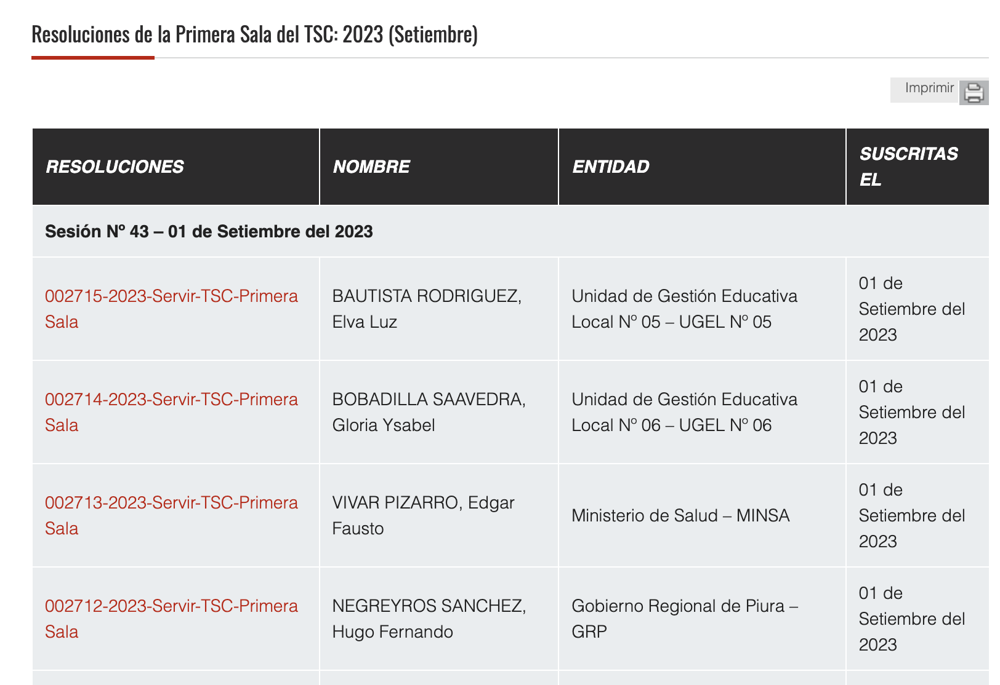

# Scrapping Servir Resoluciones page

This repo contains the python code to extract data from the [Servir resoluciones](https://www.servir.gob.pe/tribunal-sc/resoluciones-de-salas/) page. 

# Data Assets

The metadata is extracted and save in BigQuery. The data is available in the following table: Servir.Resoluciones.

The pdf files are saved in a cloud storage bucket: gs://peru-normas-legales-y-otros/servir/resoluciones.

* All the data assets are in spanish because of the data itseld is in spanish.(bucket, table, etc.). The code is completely in english.

# Metadata extraction



The table should contain the following columns:

column | description
--- | ---
fecha_extraccion | 2023-09-01
resolucion | 002715-2023-Servir-TSC-Primera Sala
resolucion_url | https://storage.servir.gob.pe//filestsc/resoluciones/2023/Sala1/Res_02715-2023-SERVIR-TSC-Primera_Sala.pdf
nombre | BAUTISTA RODRIGUEZ, Elva Luz
entidad | Unidad de Gestión Educativa Local Nº 05 – UGEL Nº 05
fecha | 2023-09-01
sesion | Sesión Nº 43 – 01 de Setiembre del 2023


## Scripts description

2 files to run. The first one is to extract the data from a whole year and the second one is to extract the data from the last date of data in BigQuery to the current date.

The code uses selenium to scrape the data.

### year.py

1. Given a year:
    1. It extracts the metadata of the year.
    2. Upload the metadata to BigQuery.

### daily.py

2. Incremental Load:
    1. get the last date of data in BigQuery.
    2. In the same year of the last date, it extracts the metadata where the date is greater than the last date.
    3. Upload the metadata to BigQuery.    

### utils.py

Contains the helper functions to extract the metadata and upload it to BigQuery or to upload files to cloud storage.

## Setup

1. Create python environment.

```bash
python3 -m venv .venv
source .venv/bin/activate && pip install --upgrade pip && pip install --upgrade setuptools
pip install -r requirements.txt
```

2. Run the main.py file

```bash
python main.py
```
